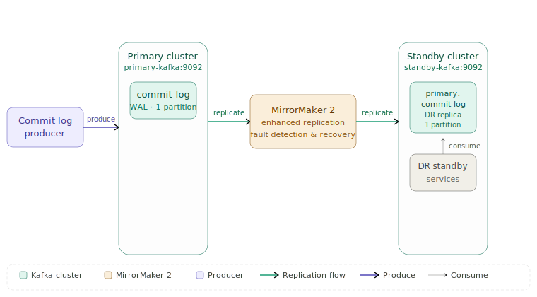

# Kafka MirrorMaker 2 — Enhanced Data Replication

## High Level Architecture



MirrorMaker 2 runs as a Kafka Connect worker and continuously reads from `commit-log` on the primary cluster, replicating every event to `primary.commit-log` on the standby cluster. The enhanced version adds two fault-detection layers on top of the default behavior: **log truncation detection** (Task 2) and **topic reset recovery** (Task 3).

---

## Low Level Architecture

```
commit-log-producer/                        ← Producer app + infra (this repo)
├── src/main/java/org/apache/kafka/tools/
│   └── CommitLogProducer.java              ← Task 1: CLI event producer
├── build.gradle                            ← Gradle fat-JAR build
├── Dockerfile                              ← Two-stage Docker build
├── docker-compose.yml                      ← Full stack definition
├── mm2.properties                          ← MirrorMaker 2 configuration
├── run_challenge.sh                        ← Automation script (all 3 scenarios)
└── README.md

```

---

## Repository Links

| Resource | URL |
|---|---|
| Kafka Fork | https://github.com/bhavna2004/kafka |
| Pull Request | https://github.com/bhavna2004/Kafka-Fork/pull/1 |

---

## Docker Hub Images

| Image | Tag | Description |
|---|---|---|
| `bhavna2004/enhanced-mirrormaker2` | `latest` | Kafka MirrorMaker 2 with log-truncation detection and topic-reset recovery |
| `bhavna2004/commit-log-producer` | `latest` | CLI application that generates synthetic WAL events |

---

## Setup Instructions

### Prerequisites

- Docker Desktop installed and running
- Docker Compose v2 (or v1 with `docker-compose`)
- Git

### Step 1 — Clone the repository

```bash
git clone https://github.com/bhavna2004/commit-log-producer.git
cd commit-log-producer
```

### Step 2 — Pull the pre-built Docker images

```bash
docker pull bhavna2004/enhanced-mirrormaker2:latest
docker pull bhavna2004/commit-log-producer:latest
```

### Step 3 — Start all services

```bash
docker compose up -d
```

This starts:
- `primary-kafka` — single-node KRaft cluster on port `29092`, hosting `commit-log`
- `standby-kafka` — single-node KRaft cluster on port `29093`, hosting `primary.commit-log`
- `mirrormaker` — enhanced MM2 reading from primary, writing to standby
- `producer` — commit-log producer (runs once then exits)

MirrorMaker 2 is configured via `mm2.properties`. It replicates the `commit-log` topic from `primary-kafka:9092` → `standby-kafka:9092` using the `primary→standby` flow.

### Step 4 — Verify services are running

```bash
docker compose ps
```

---

## Test Execution

### Run the full challenge script

**Linux / macOS / Git Bash / WSL:**
```bash
chmod +x run_challenge.sh
./run_challenge.sh
```

**Windows PowerShell / CMD:**
```powershell
bash run_challenge.sh
```

The script runs all three scenarios end-to-end and prints a final summary. Each scenario is self-contained with its own setup, execution, and pass/fail verdict.

---

### Scenario 1 — Normal Replication Flow

**What it does:** Produces 1000 messages to `commit-log` on the primary cluster and waits for them to appear on `primary.commit-log` on the standby cluster.

**Pass condition:** At least 900 messages replicated to standby within the wait window.

**Expected output:**
```
==================================================
 SCENARIO 1: Normal Replication Flow
==================================================
Production complete. Success: 1000, Failed: 0, Total: 1000
[SCENARIO 1] Waiting for MM2 to replicate messages to standby...
[SCENARIO 1] Verifying replication on standby...
  primary.commit-log found on standby (messages: 1000)
✅ SCENARIO 1 PASSED — Replication verified (1000 messages)
```

**What to watch in MM2 logs:**
```bash
docker logs mirrormaker 2>&1 | grep "replicating"
```

---

### Scenario 2 — Log Truncation Detection (Fail-Fast)

**What it does:** Pauses MM2, sets an aggressive retention policy (`retention.ms=2000`) on `commit-log`, produces 10,000 messages, waits for the broker to purge them, then restarts MM2. MM2 finds that its last committed offset is behind the log start offset — data was permanently lost.

**Pass condition:** MM2 logs contain `Log truncation detected`, `DataLossException`, or `OFFSET GAP DETECTED` and the task fails fast.

**Expected output:**
```
==================================================
 SCENARIO 2: Log Truncation Detection (Fail-Fast)
==================================================
Production complete. Success: 50, Failed: 0, Total: 50
[SCENARIO 2] Restarting MM2 — expecting fail-fast on data loss...
[+] start 3/3
 ✔ Container standby-kafka Healthy                                                                                                    0.5s
 ✔ Container primary-kafka Healthy                                                                                                    0.5s
 ✔ Container mirrormaker   Started                                                                                                    0.3s
[INFO] Waiting for MM2 to detect truncation...
  Waiting for truncation detection... (1/24)
  Waiting for truncation detection... (2/24)
✅ Truncation detected — breaking wait loop
✅ SCENARIO 2 PASSED — MM2 detected log truncation and failed fast
org.apache.kafka.connect.mirror.MirrorSourceTask$DataLossException: Log truncation detected for commit-log-0: last replicated offset was 999, but log start offset is now 11000. Messages in range [1000, 10999] have been permanently lost due to retention policy. Source cluster: primary.

```

**What to watch in MM2 logs:**
```bash
docker logs mirrormaker 2>&1 | grep -E "Log truncation detected|DataLossException|OFFSET GAP DETECTED"
```

---

### Scenario 3 — Topic Reset Recovery

**What it does:** Produces 100 messages and waits for replication to commit. Stops MM2, deletes `commit-log` from the primary cluster, waits for full deletion, then restarts MM2 and recreates the topic. Produces 50 fresh messages. MM2 detects the new topic ID, seeks to offset 0, and resumes replication automatically.

**Pass condition:** MM2 logs contain `Topic reset detected`.

**Expected output:**
```
==================================================
 SCENARIO 3: Topic Reset Recovery
==================================================
Production complete. Success: 50, Failed: 0, Total: 50
[INFO] Waiting for MM2 to detect topic reset...
✅ Topic reset detected — breaking wait loop
✅ SCENARIO 3 PASSED — MM2 detected topic reset and recovered automatically
[2026-06-08 16:32:29,931] ERROR [MirrorSourceConnector|task-0] Topic reset detected for topic commit-log-0: 99 -> 0 (org.apache.kafka.connect.mirror.MirrorSourceTask:341)
```

**What to watch in MM2 logs:**
```bash
docker logs mirrormaker 2>&1 | grep "Topic reset detected"
```

---

## Unit Test Execution

The truncation and reset detection logic is covered by unit tests that run without Docker or a live broker.

### Prerequisites

- Java 17+
- Run from inside the Kafka fork directory

```bash
cd kafka
```

**Linux / macOS / Git Bash:**
```bash
./gradlew :connect:mirror:test --tests "org.apache.kafka.connect.mirror.MirrorSourceTaskTest"
```

**Windows CMD:**
```cmd
gradlew :connect:mirror:test --tests "org.apache.kafka.connect.mirror.MirrorSourceTaskTest"
```

---

## Log Analysis

### Useful commands

```bash
# Follow MM2 logs live
docker logs -f mirrormaker

# Last 60 lines of MM2 logs
docker logs mirrormaker 2>&1 | tail -60

# Check current high-water mark on standby
docker exec standby-kafka \
  /opt/kafka/bin/kafka-get-offsets.sh \
  --bootstrap-server standby-kafka:9092 \
  --topic primary.commit-log --time -1

# Check earliest available offset on primary (log start offset)
docker exec primary-kafka \
  /opt/kafka/bin/kafka-get-offsets.sh \
  --bootstrap-server primary-kafka:9092 \
  --topic commit-log --time -2

# Filter all key scenario events from MM2 logs
docker logs mirrormaker 2>&1 | grep -E \
  "Log truncation detected|DataLossException|OFFSET GAP DETECTED|Topic reset detected"
```

### Key log messages

| Log message | Meaning |
|---|---|
| `replicating N topic-partitions` | MM2 initialized successfully and is replicating |
| `Log truncation detected for ... last replicated offset was X, but log start offset is now Y` | Task 2: data gap found at startup — MM2 fails fast |
| `OFFSET GAP DETECTED for ...: expected X but found Y` | Task 2: offset jump detected mid-run — MM2 fails fast |
| `Topic reset detected for topic '...' ... Previous topic ID: X, new topic ID: Y` | Task 3: topic was deleted and recreated — MM2 seeks to beginning |
| `Resubscribed N partition(s) of topic '...' from offset 0 after topic reset` | Task 3: recovery complete, replication resumed |

---

## Design Rationale

### Chosen approach: `MirrorSourceTask.java` only

All modifications are confined to a single file — `MirrorSourceTask.java` — with no changes to any other class, interface, or build file in the Kafka codebase. This was a deliberate choice to minimize the diff surface, make the pull request easy to review, and reduce the risk of unintended side effects.

### Task 2: Log Truncation Detection

**Problem:** Kafka's retention policy can purge messages from the source topic before MM2 replicates them. Because MM2's consumer simply resumes from its last committed offset, it has no built-in mechanism to detect that messages between that offset and the current log start offset have been permanently destroyed. The result is a silent gap in the DR replica.

**Solution:** Two detection points were added:

1. **At initialization (`detectLogTruncation`)** — called inside `initializeConsumer()` every time the task starts or restarts. For every partition that has a committed replication offset, `consumer.beginningOffsets()` is called to fetch the broker's current log start offset. If `logStartOffset > lastCommittedOffset + 1`, the intervening messages are gone. A `DataLossException` is thrown immediately so MM2 fails fast with a clear, descriptive error rather than silently producing an incomplete replica.

2. **During polling (`handleRecord`)** — each incoming record's offset is compared against the last seen offset for that partition. A forward jump larger than 1 means records were skipped mid-run. `DataLossException` is thrown again.

**Why fail-fast:** An incomplete DR replica is worse than no replica — it gives false confidence that recovery is possible when it is not. Stopping loudly forces operator awareness and investigation.

**`DataLossException`** is defined as a public static inner class inside `MirrorSourceTask` so all new code stays in one file.

### Task 3: Graceful Topic Reset Handling

**Problem:** When a topic is deleted and recreated, its offsets reset to 0 and Kafka assigns it a new internal topic ID (a UUID). MM2's stored offset from the previous incarnation is now stale. Without handling, MM2 either throws an `OffsetOutOfRangeException` or stalls on an offset that will never arrive.

**Solution:** Two complementary detection mechanisms:

1. **Topic ID comparison (`detectAndHandleTopicReset`)** — called in the `poll()` loop every 5 seconds via `TOPIC_CHECK_INTERVAL_MS`. At initialization, `recordTopicIds()` fetches and stores the Kafka-assigned UUID for each topic via the Admin client. On every subsequent check, `describeTopics()` is called again. If the UUID has changed, the topic was deleted and recreated. MM2 calls `seekToBeginning()` on all affected partitions and updates the stored ID so the check does not re-trigger.

2. **Backward offset detection (`handleRecord`)** — if a consumed record's offset is less than the last seen offset for that topic-partition, this is also a signal of topic reset. MM2 seeks to the beginning and clears the stored state for that partition.

**Why auto-recover:** Unlike data loss, topic reset is a planned maintenance operation. Operators expect MM2 to resume automatically — requiring manual restart would defeat the purpose of a DR pipeline.

### Integration approach

Both features integrate at the `poll()` call site and in `initializeConsumer()`, which are the natural entry points for per-cycle and per-start checks respectively. The existing `commit()`, `commitRecord()`, `stop()`, and `convertRecord()` methods are unchanged. The `consumerAccess` semaphore and `stopping` flag from the original code are respected throughout.

---

## AI Usage Documentation

### Tools used

Claude (Anthropic) was used throughout this project as a development accelerator.

### Methodology and specific contributions

**Understanding the codebase**
The first step was getting oriented in the Kafka MirrorMaker 2 source. Claude was asked to explain the role of `MirrorSourceTask`, how `poll()`, `initializeConsumer()`, and `commitRecord()` relate to each other, and where the natural extension points were for adding fault detection without disrupting the existing flow.

**Task 2 — Log Truncation Detection**
Claude was asked: *"Given that MirrorMaker 2 stores a committed offset in Connect's offset store and Kafka exposes `beginningOffsets()` on the consumer, how would you detect that retention has purged data between those two points?"* This led directly to the `logStartOffset > lastCommittedOffset + 1` condition in `detectLogTruncation()`. The decision to also check for offset gaps inside `handleRecord()` for mid-run truncation came from a follow-up question about what happens if truncation occurs while the task is already running.

**Task 3 — Topic Reset Detection**
Claude was asked: *"What is the most reliable way to detect that a Kafka topic has been deleted and recreated rather than just seeing a backward offset jump?"* This surfaced the topic ID (UUID) approach — Kafka assigns a new UUID on every topic creation, which is accessible via `Admin.describeTopics()`. Claude helped structure the `recordTopicIds()` / `detectAndHandleTopicReset()` pattern and explained why checking every 5 seconds via a timestamp gate is preferable to checking on every single poll invocation.

**Unit tests**
Claude was used to review the test structure and suggest edge cases: uncommitted partitions (null and -1 offsets), the boundary condition where `logStartOffset == lastCommittedOffset + 1` (no gap — must not throw), multi-partition scenarios where only one partition is truncated, and idempotency of the topic ID update after reset.

**Docker and infrastructure**
Claude helped debug docker-compose networking (why `primary-kafka:9092` works inside the Docker network but not from the host), the `segment.bytes` / `segment.ms` settings needed to make log retention actually delete segments in the truncation test, and the `topic-init` service ordering relative to MM2 startup.

**run_challenge.sh**
Claude suggested the pattern of stopping MM2 before inducing truncation/reset, and the polling loop idiom (`while true; do ... sleep 5; done`) for waiting on Kafka metadata propagation reliably across different machines.

### What was understood and verified

Every line of code in `MirrorSourceTask.java` and `MirrorSourceTaskTest.java` was read, understood, and manually verified before submission. Specific things confirmed independently:

- `consumer.beginningOffsets()` returns the log start offset (earliest retained offset), not offset 0
- Kafka's topic UUID is stable for the lifetime of a topic and changes only on deletion + recreation
- `seekToBeginning()` is lazy — it takes effect on the next `poll()` call, not immediately
- Connect's offset store persists across MM2 restarts, which is why the truncation check runs at `initializeConsumer()` on every start

---

## Cleanup

```bash
# Stop all services
docker compose down

# Stop and remove volumes (full clean state)
docker compose down -v

# Remove Docker images
docker rmi bhavna2004/enhanced-mirrormaker2:latest
docker rmi bhavna2004/commit-log-producer:latest
```